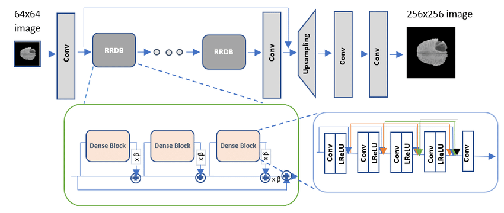

# Image Processing Bot

This Telegram bot allows users to send photos to be processed using different image super-resolution models.

## Table of Contents
- [Description](#description)
- [Installation](#installation)
- [Dependencies](#dependencies)
- [Docker Setup](#docker-setup)
- [Contributing](#contributing)
- [License](#license)

## Description
This Telegram bot processes photos using advanced image super-resolution models. Users can interact with the bot by sending photos, which are then enhanced using models such as Real-ESRGAN from Sberbank and the Real-ESRGAN version from the author.




## Installation
Follow these steps to set up the project:

1. **Clone the repository**:
    ```bash
    git clone https://github.com/your-username/image-processing-bot.git
    cd image-processing-bot
    ```

## Dependencies
- Docker

## Docker Setup
To run the bot in a Docker container:

1. **Build the Docker image**:
    ```bash
    docker build -t image-gen-bot .
    ```

2. **Run the Docker container**:
    ```bash
    docker run --env API_TOKEN=your_bot_token_here -d --name image-gen-bot image-gen-bot
    ```

Replace `your_bot_token_here` with your actual Telegram Bot API token.

## Contributing
Contributions are welcome! Please open an issue or submit a pull request for any changes.

1. Fork the repository
2. Create your feature branch (`git checkout -b feature/AmazingFeature`)
3. Commit your changes (`git commit -m 'Add some AmazingFeature'`)
4. Push to the branch (`git push origin feature/AmazingFeature`)
5. Open a pull request

## License
This project is licensed under the MIT License. 
